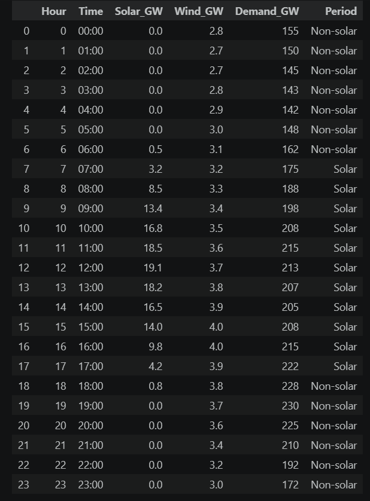
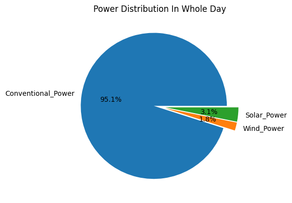
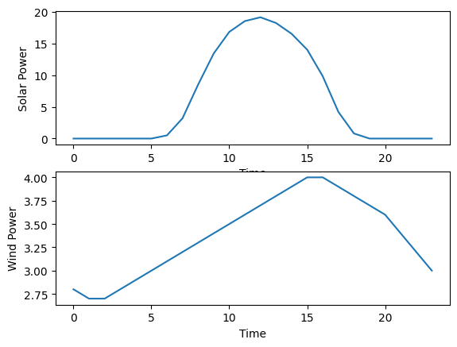

# Renewable-Energy-Demand-Analysis

## Project Overview

This project performs a descriptive analysis of electricity demand, solar generation, wind generation, and renewable energy contribution using Python.

## Technologies Used

* Python
* Pandas
* NumPy
* Matplotlib
* Jupyter Notebook

## Analysis Performed

* Electricity demand analysis
* Solar power generation analysis
* Wind power generation analysis
* Renewable energy contribution analysis
* Correlation analysis between demand, solar, and wind generation
* Peak demand period analysis
* Data visualization using charts and graphs

## Key Findings

* Conventional energy sources supplied the majority of electricity demand.
* Renewable energy contributed only a small percentage of the total demand.
* Solar generation showed higher contribution than wind generation in the dataset.
* Peak demand periods still relied heavily on conventional power generation.

## Conclusion

Based on the analyzed data, renewable energy generation alone is currently insufficient to meet total electricity demand. Conventional energy sources remain the primary contributors to power supply. Increasing renewable energy capacity and storage infrastructure would be necessary to reduce dependence on conventional generation.

## Dataset Preview

## Power Distribution in Whole Day

## Solar and Wind Generation vs Time

## Renewable Energy Contribution

## Author

Priyanshu Dash
